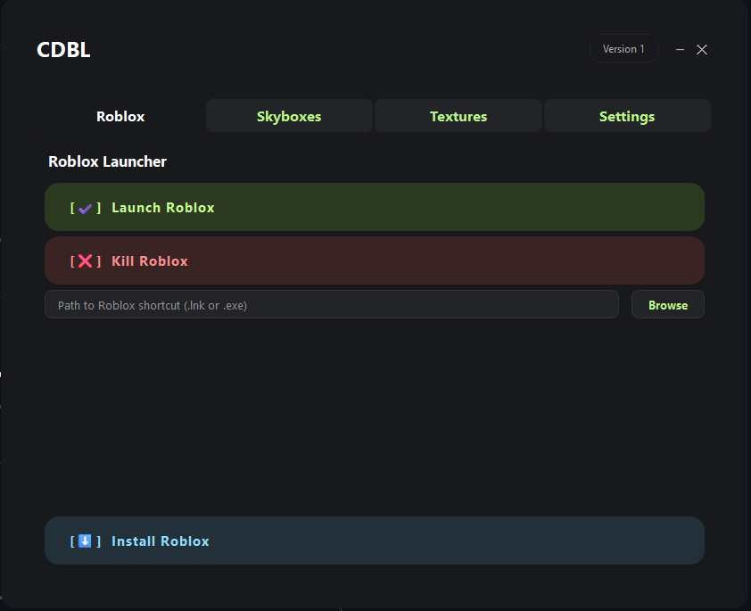
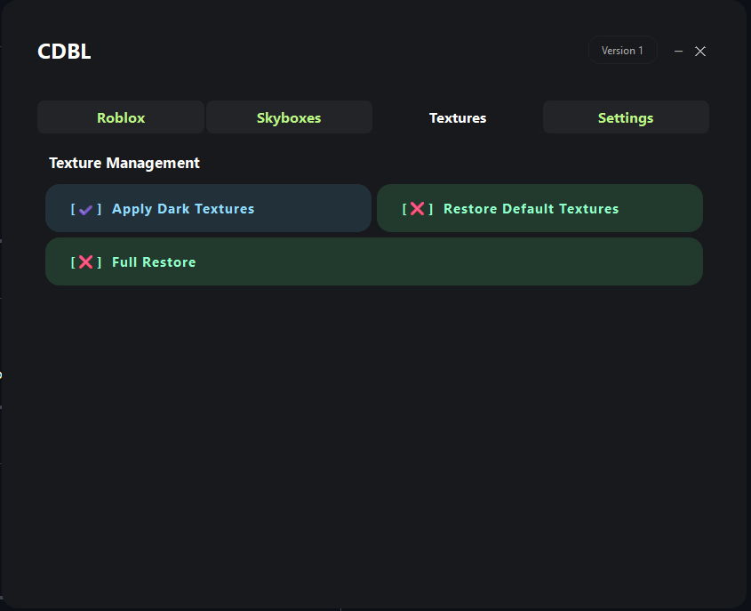
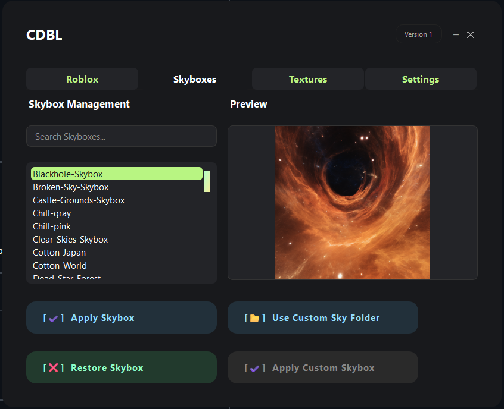
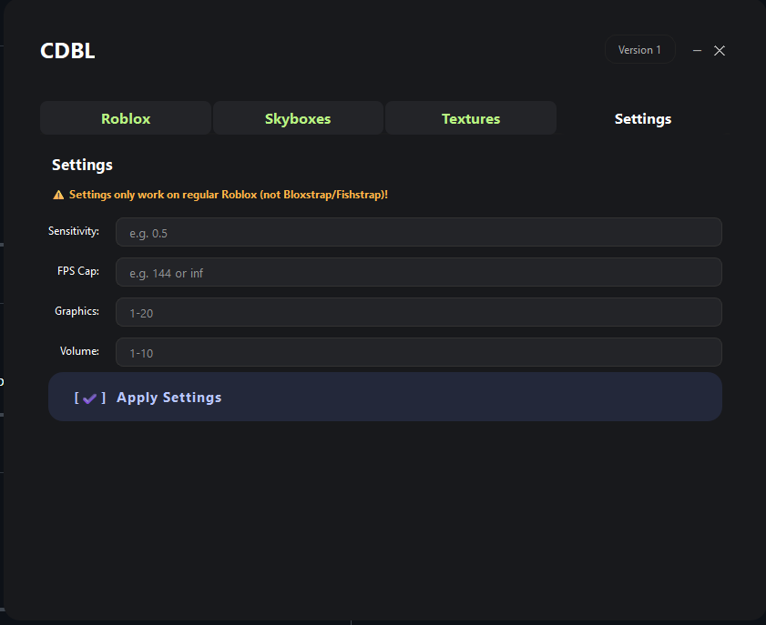

# Custom Debloated Blox Launcher (CDBL)

**Custom Debloated Blox Launcher (CDBL)** is a Windows utility for customizing and managing your Roblox installation.  
It allows you to easily patch, restore, and personalize Roblox with custom skyboxes, dark textures, and more—all with a user-friendly interface.

[Install Guide](https://github.com/eman225511/CustomDebloatedBloxLauncher?tab=readme-ov-file#installation--usage)
---

## Features

- **Skybox Manager:**  
  Browse, preview, and apply a wide selection of custom skyboxes. Skyboxes are downloaded on demand and stored in `%LOCALAPPDATA%\CustomBloxLauncher\Skyboxes`.

- **Skybox Previews:**  
  All skybox previews are downloaded and extracted from a single ZIP, stored in `%LOCALAPPDATA%\CustomBloxLauncher\Previews`.

- **Dark/Light/Default Textures:**  
  Easily switch between dark, light, and default Roblox textures.

- **Settings Tweaks:**  
  Adjust sensitivity, FPS cap, graphics, and volume using a PowerShell script.

- **Restore Functions:**  
  Restore original Roblox skyboxes and textures at any time.

- **Automatic Dependency Handling:**  
  The included `Install-and-Run.bat` script will install Python 3.12 (if needed), set up dependencies, and launch the app—even if your folder has spaces.


|   |  |
| ------------- | ------------- |
|   |   |
|   |   |

---

## Installation & Usage

1. **Go to [Here](https://github.com/eman225511/CustomDebloatedBloxLauncher/releases/tag/src) and downlaod `CDBL.zip`**

2. **Run the Launcher Script**

   Double-click `Install-and-Run.bat`.  
   - This will install Python 3.12 (if needed), dependencies, and launch the app as administrator.

3. **Using the App**

   - **Skyboxes:**  
     Select a skybox from the list to preview. Click "Apply" to download and install it.
   - **Textures:**  
     Use the buttons to apply dark, light, or default textures.
   - **Settings:**  
     Use the settings dialog to tweak Roblox settings.
   - **Restore:**  
     Use the restore options to revert to original Roblox files.

---

## File Structure

```
CDBL/
│
├─ main.py                # Main application code
├─ Install-and-Run.bat    # One-click installer and launcher
├─ requirements.txt       # Python dependencies
├─ src/
│   └─ skybox/            # (Legacy) Local skybox storage (now uses %LOCALAPPDATA%)
├─ func/
│   ├─ APIFunc.py         # Download, unzip, and utility functions
│   ├─ ApplySkybox.py     # Skybox patching logic
│   ├─ ApplyDark.py       # Dark texture patching logic
│   └─ Restore.py         # Restore functions
└─ README.md
```

---

## Data Storage

- **Skyboxes:**  
  `%LOCALAPPDATA%\CustomBloxLauncher\Skyboxes\`

- **Skybox Previews:**  
  `%LOCALAPPDATA%\CustomBloxLauncher\Previews\`

- **Downloads (temp):**  
  `%LOCALAPPDATA%\CustomBloxLauncher\Downloads\`

---

## Requirements

- Windows 10/11
- Python 3.12 (auto-installed if missing)
- Internet connection (for downloading skyboxes, previews, and patches)

---

## Credits

- [eman225511/CustomDebloatedBloxLauncher](https://github.com/eman225511/CustomDebloatedBloxLauncher)  
- [KickfnGIT/DebloatedBloxLauncher](https://github.com/KickfnGIT/DebloatedBloxLauncher) for this [code](https://github.com/eman225511/CustomDebloatedBloxLauncher/blob/main/func/ChangeSettings.ps1)
- Huge thanks to @kaizenken on discord for the skyboxes
- And huge thanks to @alana.py on discord for the help

---

## License

This project is for educational and personal use.  
Not affiliated with Roblox Corporation.
